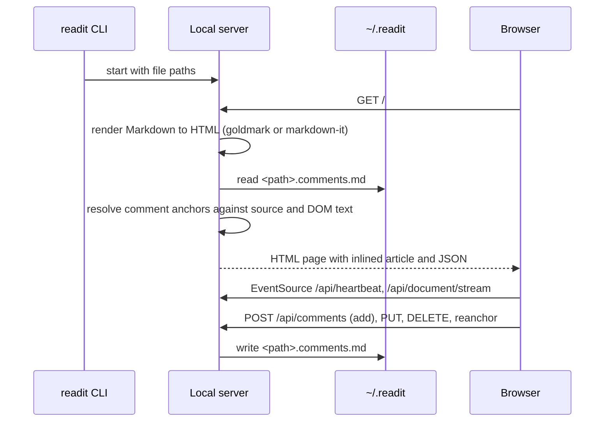
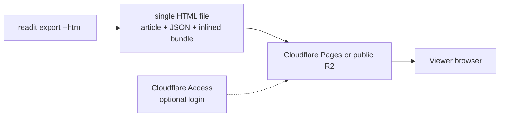
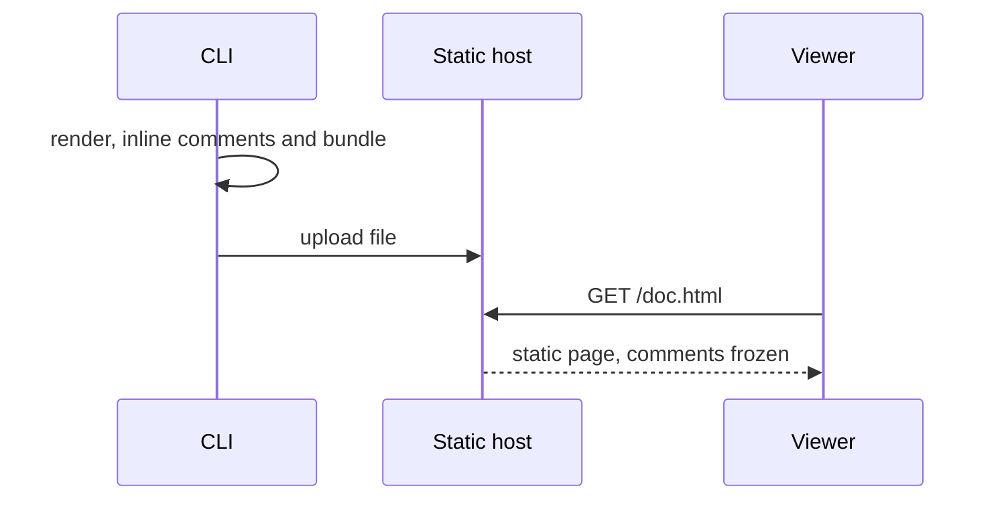
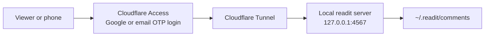
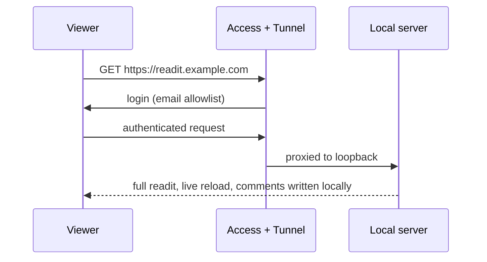
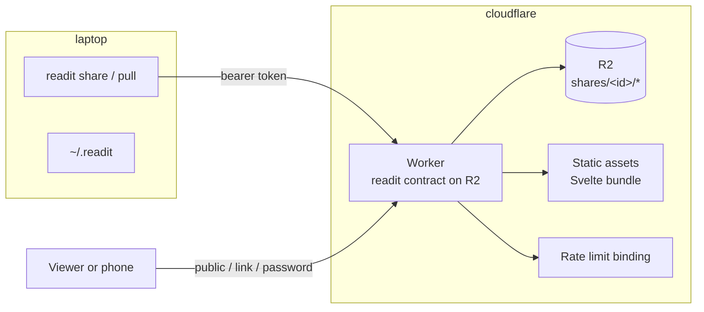
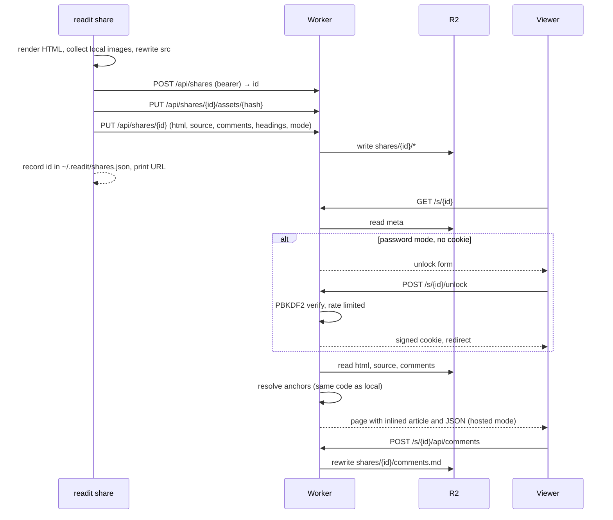
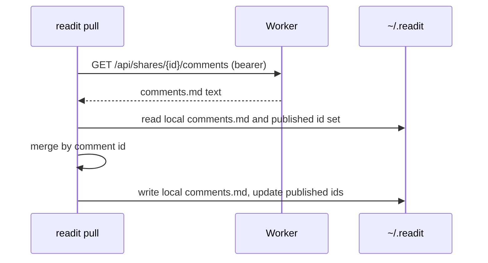

# Share to Cloudflare: Design

Status: Proposed
Date: 2026-09-02
Relates to: US-011 (Collaborative Review) in `.claude/user-stories.md`, "Cross-Machine Path Differences" in `docs/design.md`

## 1. Background

readit reviews live on one laptop. To read a document on a phone, or to hand a reviewed document to someone else, the author today has to copy the Markdown into Obsidian, Notion, or Google Docs, and the margin comments do not come along. The review UI that makes readit useful is the thing that cannot leave the machine.

Why now: the author reads their own documents on the go and wants collaborators to see a review "as is", with highlights and margin notes, from a link. Both needs are read-mostly, involve five to ten people at most, and should cost close to nothing to run. Cloudflare's free tiers cover that scale comfortably, and the project already renders everything server-side, which makes a hosted copy cheap to build.

This document decides how a document gets from a laptop to a URL, and who can open that URL.

## 2. Current implementation

Both servers, the Bun one shipped through npm and the Go single binary, implement the same API contract and serve the same Svelte bundle. The page is assembled server-side: the rendered article is inlined into the HTML, a JSON blob carries files, headings, comments, and settings, and the Svelte app adopts the existing article node instead of re-rendering.



Constraints the design must respect:

- **Documents are keyed by absolute local path.** Comment files live at `~/.readit/comments/<abs-path>.comments.md` and the front matter records the absolute `source`. A hosted copy cannot use this identity and must not leak it.
- **Anchors resolve at load time, against live source and rendered HTML.** Offsets are never persisted; a hosted copy needs the source Markdown alongside the HTML, or comments cannot be positioned or re-anchored.
- **`.comments.md` is the canonical format.** `docs/design.md` states that exports are transforms, not storage. Whatever holds comments in the cloud must not become a second source of truth with a different shape.
- **Two server implementations, one contract.** The Go rewrite decision requires request and response shapes to stay identical. New behavior is specified as contract, then implemented.
- **No relative asset support exists today.** Neither server rewrites or serves ``. Local images are new work in any option.
- **The browser assumes a live server.** The heartbeat and document-stream EventSources reconnect forever with backoff, and a missing endpoint leaves the disconnect banner permanently visible.
- **No prior threat model.** Everything binds to loopback by default. This is the first feature that exposes readit beyond the machine, so it introduces auth from zero.

## 3. Options

### Option A: Static export to a static host (baseline)

**Why this option.** The most direct reading of "share as is": produce one self-contained HTML file from what the server already renders, and upload it to any static host. No server code at all.





Good:
- Smallest possible implementation, roughly a new CLI command and an upload.
- Nothing to run or secure beyond the host. Public or Access-gated, nothing in between.
- Read-only by construction, so the single-source-of-truth rule is never at risk.

Bad:
- No web comments. Collaborators can read but their feedback goes back through chat.
- Link privacy and password modes have to come from the host. Cloudflare Access covers "login with email allowlist", not "anyone with a password".
- The Svelte app still opens EventSources and shows the disconnect banner unless the bundle is patched, so the "no code" claim erodes quickly.
- Each publish is a fresh file; there is no stable identity to update or unshare.

### Option B: Tunnel to the live local server (first-principles)

**Why this option.** Every other option assumes the document must be copied to the cloud. Question that: the local server already does everything the viewer needs, including live reload and writing comments straight into the local file. Expose it instead of copying it. `cloudflared` gives a stable hostname to a loopback port, and Cloudflare Access puts identity in front of it. Zero new server code.





Good:
- Full feature parity for free: live reload, task toggles, re-anchoring, settings, all against the real files.
- Comments land in the real `.comments.md`, so there is no merge step at all.
- Cloudflare Access is free for fifty seats and the config is two dashboard screens.

Bad:
- The laptop must be awake and online. This fails exactly the "read it on the go" case when the machine is asleep in a bag.
- Every viewer gets the full write surface, including task toggles that edit the source Markdown, and the multi-tab last-write-wins limitation now applies across people.
- No "anyone with the link" or password mode. Access is identity-based; every viewer needs an email on the allowlist.
- The tunnel exposes whichever documents the server happens to have open, not a chosen one.

### Option C: Snapshot publish to a Worker that implements the readit contract (recommended)

**Why this option.** Treat the Worker as a third readit server whose filesystem is R2. The CLI renders locally and pushes a snapshot: HTML, headings, source Markdown, the `.comments.md` text, and any local images. The Worker serves the unchanged Svelte bundle, assembles the page exactly as the two existing servers do, and implements the read and comment routes of the existing contract on top of R2. Share metadata decides who can open it. `readit pull` merges web comments back into the local file.



Publish and view:



Pull:



Good:
- Works when the laptop is off. The share is durable, updatable, and unshareable by a stable id.
- All three access modes, public, link, and password, live in one place and need no vendor SDK.
- Collaborators comment in the real UI. The Worker reuses the pure anchor, text-extraction, and comment-format code, so behavior matches local readit.
- The cloud copy of comments is a `.comments.md` file, so the canonical format rule holds; the Worker is another implementation of the same contract, not a new schema.
- Self-hosted with `wrangler deploy`, no multi-tenancy, no billing, and free at this scale.

Bad:
- The largest build of the three: a Worker, a publish protocol, CLI commands, image handling, and a hosted mode in the frontend.
- Snapshots go stale; a republish is a manual step. Live reload is out of scope.
- Web comments and local comments diverge between publish and pull, and the merge needs a rule for deletions.
- Concurrent viewers writing the same `comments.md` inherit the documented last-write-wins behavior.

## 4. Recommendation

Option C. The decisive comparison points:

- **Versus A**, the baseline cannot give collaborators a way to comment, and it cannot express "anyone with this link" or "anyone with this password" without a server anyway. Once the bundle must be patched to stop reconnecting and a server must exist for password checks, A has grown into C with worse structure.
- **Versus B**, the tunnel is elegant and costs nothing, but it fails the mobile case whenever the laptop sleeps, and it hands every viewer full write access to real files. It is worth keeping as a complementary trick for live pairing sessions, and nothing in C prevents adding it later, but it cannot be the sharing feature.
- C is the only option that satisfies both stated needs, the phone and the collaborator, with the same URL, and it does so by adding a third implementation of a contract the project already maintains in two languages rather than by inventing a new surface.

Decisions bundled into the recommendation:

| Decision | Choice | Rationale |
|---|---|---|
| Hosting model | Self-hosted Worker per user, `wrangler deploy` from `worker/` | Five to ten users. A hosted service adds multi-tenancy, abuse, and billing for no benefit |
| Storage | R2 only, one prefix per share | One binding to reason about. Metadata is a small JSON object beside the snapshot. D1 and KV are not needed at this scale |
| Identity | Random 128-bit share id, path-independent | Breaks the absolute-path dependency and never leaks the author's filesystem |
| Publisher auth | Single bearer token in a Worker secret, constant-time compare | Publishing is one person or a handful; no accounts exist to sign up for |
| Viewer auth | `public`, `link`, `password` share modes, password via PBKDF2 and an HMAC-signed path-scoped cookie | The Google Docs model collaborators already understand. No vendor SDK, no redirect flow |
| Owner dashboard | None in v1; management is `readit share`, `readit unshare`, `readit remote list` | Cloudflare Access on a `/dashboard` path is the zero-code addition if a browser UI is wanted later |
| Comment storage in the cloud | `.comments.md` text in R2 | Keeps the canonical format; `readit pull` is a merge of two files of the same shape |
| Merge rule | Remote wins for ids that were published; remote-only ids are appended; a published id missing remotely is a remote deletion | Uses the published id set recorded at publish time to tell "deleted on the web" from "added locally since" |
| Which CLI publishes | Bun CLI in v1 | It shares TypeScript with the Worker and renders Mermaid to SVG server-side, which snapshots need. Go CLI parity is deferred and listed |
| Frontend | One hosted mode flag and an API base prefix; heartbeat and document stream disabled; settings persist to localStorage; task checkboxes disabled | Minimal, explicit changes instead of fake endpoints |
| Caching | Static assets immutable, images immutable by content hash, pages `no-store` except public mode with a short shared max-age | Correctness first; caching does not matter at this scale |

Out of scope for v1: live reload of shares, multi-document shares, a browser dashboard, Cloudflare Access integration, a hosted readit service, Go CLI parity, propagating web-side comment edits to a document that changed locally in between (the existing anchor fallback handles the positioning, nothing else is attempted).

## 5. Appendix

### 5.1 Worker routes

Publisher routes require `Authorization: Bearer <token>`.

| Route | Purpose |
|---|---|
| `GET /api/health` | Liveness |
| `GET /api/shares` | List shares (id, fileName, mode, updatedAt) |
| `POST /api/shares` | Create a share, returns `{ id, url }` |
| `PUT /api/shares/{id}` | Replace the snapshot: html, source, comments, headings, hash, fileName, optional mode and password |
| `PATCH /api/shares/{id}` | Change mode or password only |
| `DELETE /api/shares/{id}` | Remove the share and its objects |
| `HEAD`, `PUT /api/shares/{id}/assets/{name}` | Check or upload one content-addressed image |
| `GET /api/shares/{id}/comments` | Raw `comments.md` text for `readit pull` |

Viewer routes are gated by the share's mode.

| Route | Purpose |
|---|---|
| `GET /s/{id}` | The page, or the unlock form in password mode |
| `POST /s/{id}/unlock` | Password check, sets cookie, redirects |
| `GET /s/{id}/assets/{name}` | Images |
| `GET /s/{id}/api/document` | Same shape as local `/api/document` |
| `GET, POST, DELETE /s/{id}/api/comments` | Same shapes as local |
| `PUT, DELETE /s/{id}/api/comments/{cid}` | Same shapes as local |
| `PUT /s/{id}/api/comments/{cid}/reanchor` | Same shape as local |
| `GET /s/{id}/api/comments/raw` | Same shape as local |
| `GET /assets/*` | Svelte bundle from Worker static assets |

Not implemented in the Worker and disabled in hosted mode: `/api/heartbeat`, `/api/document/stream`, `PATCH /api/document/task`, `PUT /api/settings`, `POST /api/documents`.

### 5.2 R2 layout

```
shares/{id}/meta.json       { id, fileName, hash, mode, password?, headings, createdAt, updatedAt }
shares/{id}/document.md     source Markdown
shares/{id}/document.html   rendered article HTML, image src already rewritten
shares/{id}/comments.md     .comments.md text, source set to /s/{id}/{fileName}
shares/{id}/assets/{sha256-16}.{ext}
```

`password` is `{ salt, hash, iterations }`, PBKDF2-SHA256 via WebCrypto. Changing the password rotates the salt, which invalidates every existing cookie.

### 5.3 Viewer access control

| Mode | Rule |
|---|---|
| `public` | Anyone. Page may carry `Cache-Control: public, s-maxage=60` |
| `link` | Anyone who knows the id. The id is 128 bits, base64url, 22 characters. `no-store`, `X-Robots-Tag: noindex` |
| `password` | Requires cookie `readit_unlock_{id}` whose value is `base64url(HMAC-SHA256(secret, id + ":" + salt))`. Cookie is `Path=/s/{id}; HttpOnly; Secure; SameSite=Lax; Max-Age=30d`. Unlock attempts are rate limited per share and client IP through the Workers rate limiting binding |

### 5.4 Hosted mode in the frontend

The inline JSON gains two optional fields:

```
hosted: true
apiBase: "/s/{id}"
```

Every `fetch` and `EventSource` URL goes through one helper that prepends `apiBase`. In hosted mode the app does not start the heartbeat or document stream, persists font and keybinding settings to localStorage, and renders task checkboxes disabled. `activeFile` is `/s/{id}/{fileName}`, which keeps the localStorage draft keys unique per share on a shared origin.

### 5.5 CLI surface and local state

```
readit remote setup            prompt for Worker URL and token, write ~/.readit/config.json (mode 600)
readit remote list             list shares on the remote
readit share <file>            publish or republish; default mode is link
readit share <file> --public
readit share <file> --password [pw]   prompt when omitted
readit unshare <file>
readit pull <file>             merge web comments into the local .comments.md
```

Environment overrides: `READIT_REMOTE_URL`, `READIT_TOKEN`.

`~/.readit/shares.json` maps absolute local path to `{ id, url, mode, publishedIds }`. `publishedIds` is the set of comment ids that existed at the last publish or pull, which the merge rule uses to detect remote deletions.

### 5.6 Image handling

The publish step scans the rendered HTML for `` values that are not absolute URLs or data URIs, resolves them against the document's directory, uploads each as `assets/{sha256-16}.{ext}` if the Worker does not already have it, and rewrites the `src` to `/s/{id}/assets/{name}`. Images contribute no text to the extracted DOM text, so rewriting does not move comment offsets. Limits: 10 MB per image, 50 MB per share, and unresolved paths are left as-is with a warning.

### 5.7 Threat model

| Threat | Mitigation |
|---|---|
| Publisher token leak | Token is a Worker secret, never in the repo; rotate with `wrangler secret put` |
| Link enumeration | 128-bit ids; listing requires the publisher token |
| Password brute force | PBKDF2 with 100k iterations; rate limit binding at five attempts per minute per share and IP |
| Cookie theft or reuse across shares | Path-scoped, HttpOnly, signed with a per-deployment secret and the share's salt |
| Author path leakage | `source` in the pushed `comments.md` is rewritten to the share path; `workingDirectory` is empty in hosted mode |
| XSS via the document | The author is the token holder and is trusted; the HTML still goes through the existing sanitizer before publish |
| XSS via viewer comments | Comment bodies render through Svelte text interpolation, which escapes. The one `{@html}` in the app is the Mermaid modal, which renders author content only |
| Search engines | `noindex` on link and password shares; public shares are indexable on purpose |

### 5.8 Cloudflare free-tier limits relied on

| Product | Free tier |
|---|---|
| Workers | 100k requests per day, 10 ms CPU per invocation |
| R2 | 10 GB storage, 1M class A and 10M class B operations per month |
| Static assets | Unlimited requests |
| Rate limiting binding | Available; eventually consistent, which is acceptable for brute-force throttling |
| Cloudflare Access (future) | 50 seats, path-scoped applications with Bypass policies |

### 5.9 References

- `docs/design.md` — comment storage format, "Export is a Transform", cross-machine path limitation
- `docs/superpowers/specs/2026-03-27-go-server-rewrite-design.md` — one contract, two servers
- `.claude/user-stories.md` US-011 — this design implements the link-sharing half; real-time sync stays a future consideration
- https://developers.cloudflare.com/workers/platform/pricing/
- https://developers.cloudflare.com/workers/runtime-apis/bindings/rate-limit/
- https://developers.cloudflare.com/cloudflare-one/access-controls/policies/
